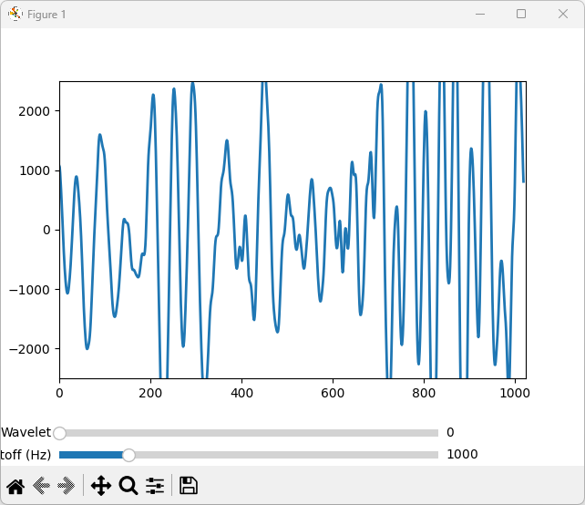

# **Audio Visualizer and Noise Filter**

This Python project allows you to visualize real-time audio input and apply various noise-filtering techniques, including spectral subtraction and wavelet denoising. The program also provides an interactive interface for adjusting the cutoff frequency of a low-pass filter and selecting different wavelet options to denoise the audio signal.

## **Features**

- **Real-time Audio Visualization**: Displays the audio waveform as it's being captured in real-time.
- **Noise Filtering**: Offers multiple techniques for noise reduction, including:
  - **Spectral Subtraction**: A method for estimating and removing noise in the frequency domain.
  - **Wavelet Denoising**: Uses wavelet transforms for smoothing and denoising the audio signal.
  - **Low-pass Filtering**: Reduces high-frequency noise using a butterworth low-pass filter.
- **Interactive Control**: Allows users to adjust parameters like cutoff frequency and select different wavelets through interactive sliders.

## **Requirements**

This project requires the following Python libraries:

- `pyaudio` - For capturing audio input in real-time.
- `numpy` - For handling numerical data and performing signal processing operations.
- `matplotlib` - For visualizing the audio waveform and providing interactive sliders.
- `scipy` - For advanced signal processing functions like FFT, filtering, and spectral subtraction.
- `pywt` - For wavelet-based denoising techniques.

You can install the required dependencies using `pip`:

```bash
pip install -r requirements.txt
```

## **Usage**

1. **Clone the repository**:

   ```bash
   git clone https://github.com/your-username/audio-visualizer-noise-filter.git
   cd audio-visualizer-noise-filter
   ```

2. **Install the dependencies**:

   If you don't have the dependencies installed, run the following:

   ```bash
   pip install -r requirements.txt
   ```

3. **Run the program**:

   Execute the script to start capturing audio and visualize it with noise filtering:

   ```bash
   python audio_visualizer.py
   ```

4. **Adjust parameters interactively**:
   - **Cutoff Frequency**: Use the slider to adjust the cutoff frequency for the low-pass filter.
   - **Wavelet Selection**: Choose the wavelet type for wavelet denoising using the corresponding slider.

5. **Stop the program**:
   Press `Ctrl + C` to stop the real-time audio processing.

## **How it Works**

### **Audio Capture**

The program captures audio input in real-time using the `pyaudio` library. The audio is sampled at 44.1 kHz (`RATE = 44100`) with 16-bit precision (`FORMAT = pyaudio.paInt16`). The program processes the audio in chunks of `1024` samples (`CHUNK`), which are continuously updated and displayed.

### **Noise Filtering**

- **Low-pass Butterworth Filter**: A Butterworth low-pass filter is applied to the audio signal to remove high-frequency noise. The cutoff frequency of the filter can be adjusted interactively using a slider.
  
- **Spectral Subtraction**: This technique reduces noise by estimating the noise spectrum and subtracting it from the noisy signal in the frequency domain.
  
- **Wavelet Denoising**: The audio signal is decomposed using a wavelet transform (`pywt.wavedec`), and noise is removed by thresholding the wavelet coefficients. The wavelet type and decomposition level can be selected interactively.

### **Visualization**

The program plots the audio waveform using `matplotlib`, and real-time updates occur with the filtered audio data. The waveform is updated continuously, with smooth transitions between frames.

### **Interactive Controls**

- **Cutoff Frequency (Hz)**: This slider adjusts the cutoff frequency for the low-pass filter.
- **Wavelet Selection**: This slider allows the user to choose different wavelets for wavelet denoising, such as `db8`, `sym2`, `coif1`, and `bior1.3`.

### **Code Overview**

#### `AudioVisualizer` Class
Handles the real-time plotting and updating of the audio waveform.

#### `NoiseFilter` Class
Implements the low-pass filter using a Butterworth filter and provides methods for applying the filter to the audio data.

#### `spectral_subtraction` Function
Performs spectral subtraction to remove noise in the frequency domain.

#### `wavelet_denoising` Function
Applies wavelet denoising to the audio data to remove noise by thresholding the wavelet coefficients.

#### `plot_audio_waveform` Function
Captures audio data, applies filtering, and updates the visualization.

#### `update_cutoff` and `update_wavelet` Functions
Handle the updates for the interactive sliders, changing the filter cutoff frequency and wavelet selection.

## **Example**

Here’s a basic overview of what the visualization looks like:

1. **Raw Audio**: The waveform shows the raw audio signal.
2. **Filtered Audio**: After applying noise filtering, the waveform smoothens and becomes more clear.
3. **Interactive Control**: You can adjust the noise filtering and wavelet settings dynamically to improve the visualization.



## **Contributing**

Feel free to fork this repository and submit pull requests if you have any improvements or bug fixes. Contributions are always welcome!

## **License**

This project is licensed under the MIT License - see the [LICENSE](LICENSE) file for details.

---